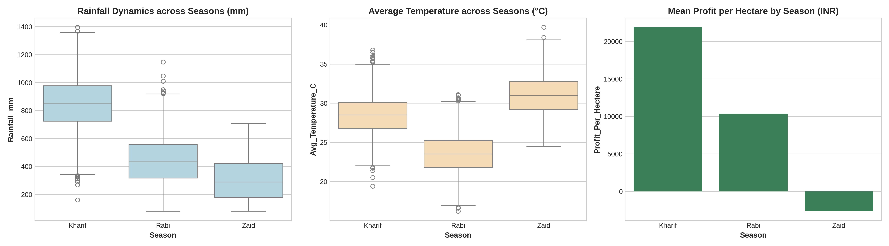
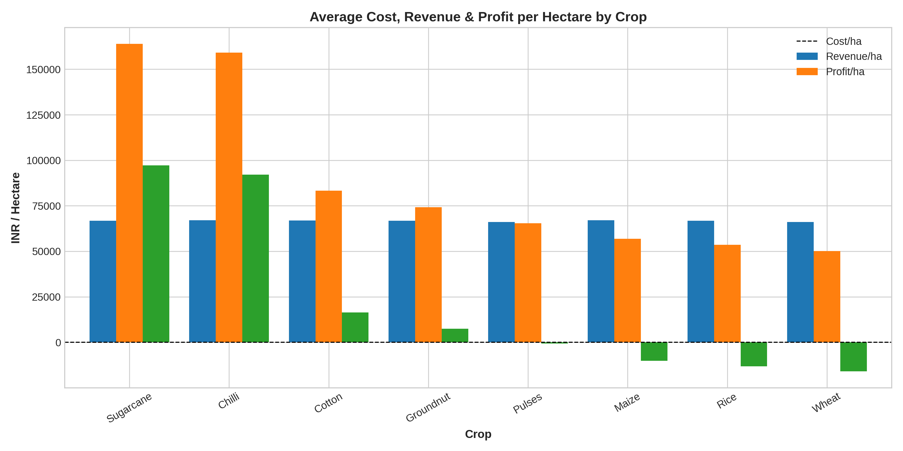
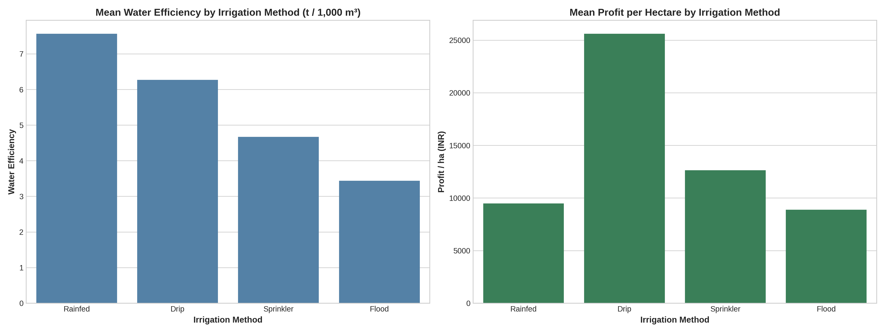
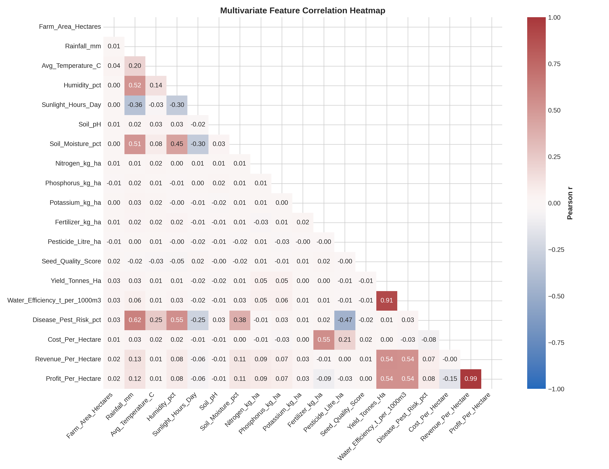

# Major Project: Seasonal Agriculture Performance Analysis

## 1. Introduction to Dataset
The dataset represents agricultural activities carried out across different seasons, geographical areas, and farming conditions[cite: 2]. It contains 4,000 records and 27 variables related to farming practices, environmental conditions, crop production, resource usage, and economic performance[cite: 1, 2].

The dataset provides an opportunity to explore how agricultural performance changes across seasons and to identify meaningful patterns and differences through data analysis[cite: 2].

## 2. Problem Statement
Agricultural activities are influenced by seasonal variations in environmental conditions, farming practices, resource availability, and market conditions[cite: 2]. As a result, agricultural performance differs significantly across seasons[cite: 2].

The objective is to analyze the dataset and investigate seasonal differences in agricultural performance by identifying meaningful patterns, trends, relationships, and variations across production, water efficiency, and financial outcomes[cite: 2].

## 3. Key Findings & Season Summary
Agricultural performance is heavily determined by seasonal conditions, with **Kharif** emerging as the most productive and profitable season, while **Zaid** experiences negative average returns.

| Season | Records | Avg Yield (t/ha) | Avg Profit (INR) | Avg Rainfall (mm) | Avg Temp (°C) | Avg Water Used (m³) |
| :--- | :--- | :--- | :--- | :--- | :--- | :--- |
| **Kharif** | 1,333 | 5.63 | INR 178,914.65 | 849.20 | ~27.5 | 6,102.20 |
| **Rabi** | 1,333 | 5.04 | INR 87,689.47 | 437.62 | 23.49 | ~5,800.00 |
| **Zaid** | 1,334 | 4.64 | INR -24,804.82 | 304.65 | 31.04 | 6,419.89 |

*(Note: Seasonal metrics calculated across all records in the cleaned dataset[cite: 1].)*

---

## 4. Visual Insights & Analytical Charts

### Seasonal Climate & Financial Dynamics
Higher rainfall and moderate temperatures directly drive higher profitability per hectare[cite: 1].


### Crop Performance & Profitability
Sugarcane and Chilli deliver the highest average profits per hectare, whereas select field crops face tighter margins[cite: 1].


### Irrigation Efficiency Audit
Modern irrigation approaches such as Drip and Sprinkler significantly outpace flood methods in water efficiency and net returns[cite: 1].


### Multivariate Feature Correlation
Yield, water efficiency, and soil nutrient balance are strong correlates of overall farm profitability[cite: 1].


---

## 5. Answers to Key Project Questions

* **How does agricultural performance vary across seasons?**  
  Kharif is the strongest season with an average yield of 5.63 tonnes/ha and an average profit of INR 178,914.65[cite: 1]. Rabi follows at 5.04 tonnes/ha and INR 87,689.47, while Zaid falls to 4.64 tonnes/ha with a negative average profit of INR -24,804.82[cite: 1].

* **What major seasonal patterns can be observed?**  
  Higher rainfall correlates strongly with profitability[cite: 1]. Kharif registers the highest rainfall (849.20 mm), followed by Rabi (437.62 mm) and Zaid (304.65 mm), with profit margins dropping as precipitation declines[cite: 1].

* **Which characteristics change between seasons?**  
  The main differences are rainfall, temperature, soil moisture, water use, and profitability[cite: 1]. Kharif averages 849.20 mm rainfall and 31.15% soil moisture; Rabi averages 437.62 mm and 24.07%; Zaid drops to 304.65 mm and 19.28% while temperatures increase from 23.49°C (Rabi) to 31.04°C (Zaid)[cite: 1].

* **What differences exist between agricultural activities in different seasons?**  
  Kharif delivers the strongest farming performance because of higher rainfall and favorable growing conditions[cite: 1]. Rabi remains productive and economically viable, while Zaid represents the highest risk profile where a large portion of farms record net losses[cite: 1].

* **Are there noticeable variations in resource usage across seasons?**  
  Yes. Zaid consumes the most water on average (6,419.89 m³) yet yields the worst economic performance[cite: 1]. In comparison, Kharif uses 6,102.20 m³ while yielding the highest profit, demonstrating that water quantity alone cannot substitute for favorable climate conditions[cite: 1].

* **Are there relationships between seasonal environmental conditions and agricultural performance?**  
  Yes. Higher rainfall and moderate temperatures correlate with higher yields and margins[cite: 1]. Kharif balances high rainfall and moderate temperatures for peak output, while Zaid experiences heat stress and low precipitation[cite: 1].

* **How do economic outcomes vary across seasons?**  
  * **Kharif:** Average revenue of INR 710,719.06 vs. average cost of INR 531,804.41 (Profit: INR 178,914.65)[cite: 1].  
  * **Rabi:** Average revenue of INR 601,526.05 vs. average cost of INR 513,836.58 (Profit: INR 87,689.47)[cite: 1].  
  * **Zaid:** Average revenue of INR 519,171.90 vs. average cost of INR 543,976.73 (Net Loss: INR -24,804.82)[cite: 1].

* **Are some seasonal patterns consistent across different regions or categories?**  
  Yes. Across states and crops, favorable seasons yield higher profitability[cite: 1]. Punjab and Maharashtra rank as top-performing states, while cash crops like Sugarcane and Chilli maintain top margins[cite: 1].

* **Are there unusual or unexpected seasonal patterns?**  
  Zaid farms use more total irrigation water than Kharif farms, yet still produce the lowest yields and net negative profits[cite: 1]. This highlights that water application without heat moderation or adequate soil moisture cannot prevent crop stress[cite: 1].

* **What insights can be derived from the observed seasonal differences?**  
  Kharif is the most reliable commercial season[cite: 1]. For Zaid farming to remain viable, operations require drought-resilient crop selection, optimized micro-irrigation, and precision nutrient management[cite: 1].

* **What conclusions can reasonably be drawn from the available data?**  
  Agricultural outcomes in this dataset are structurally seasonal[cite: 1]. Environmental factors—specifically natural rainfall and temperature windows—dictate farm-level profitability and resource efficiency[cite: 1].

* **How could the findings support better seasonal agricultural planning?**  
  Agricultural planning can prioritize high-value commercial crops during Kharif, match irrigation methods to seasonal water constraints, and limit economic exposure during Zaid through heat-tolerant crops and efficient water management[cite: 1].

---

## 6. Project Structure

```text
├── output_analysis/
│   ├── figures/             # 10 publication-quality plots (PNG)
│   └── reports/             # Aggregated CSV summaries & OLS regression results
├── Cleaned_Agriculture_Data.json # Preprocessed dataset (4,000 records)
├── agricultural_analysis.ipynb   # Complete analysis & modeling pipeline
└── README.md                     # Project report & documentation
---

## 7. How to Run

Clone this repository or download all repository files into one directory.

Open agricultural_analysis.ipynb in Google Colab or JupyterLab.

Ensure Cleaned_Agriculture_Data.json is located in the root folder[cite: 1].

Run all cells sequentially to regenerate data tables, statistical models, and plots.
